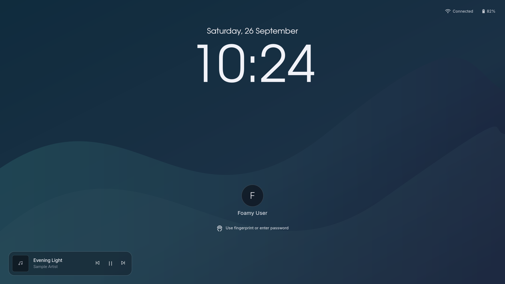

# Foamy Lock

A lock screen for Omarchy Quattro with a large clock, account name and avatar,
password and fingerprint authentication, network and battery status, and media
controls. It uses Omarchy's wallpaper and authentication services.



The screenshot uses synthetic account and media details and a neutral wallpaper.

## Install

This plugin requires Omarchy Quattro, its Quickshell build, and the existing
`/etc/pam.d/omarchy-lock-password` service. Fingerprint unlock also requires
Omarchy's fingerprint setup and an enrolled fingerprint. The plugin does not
install or change PAM configuration. The layout uses Adwaita Sans, URW Gothic,
and JetBrainsMono Nerd Font; install these fonts for the intended typography and
status icons.

Artwork additionally uses system Python 3, ImageMagick 7, and Bubblewrap with
unprivileged namespaces and seccomp support (x86-64 or AArch64 Linux). If the
helper or its sandbox cannot run, the music icon is shown. There is no
unsandboxed decoding fallback, and authentication does not depend on artwork.

Install while your session is unlocked:

```sh
omarchy plugin add https://github.com/foamrider/foamy-lock.git
```

If another custom lock plugin is enabled, answer **No** to the enable prompt and
replace its entry with `foamy.lock` in `~/.config/omarchy/shell.json` as shown below.
Otherwise, you can enable Foamy Lock at the prompt; Omarchy disables the stock
lock service automatically. Keep exactly one lock service active, and keep
`omarchy.lock` in `disabledPlugins`. Preserve all unrelated entries and settings.

Apply the initial switch with `omarchy restart shell` **while unlocked**. Lock
normally with `omarchy system lock`. Restarting the shell while locked can leave
the compositor showing its lock-screen recovery screen.

## Settings

Settings belong directly on the plugin entry in the `plugins` array of
`~/.config/omarchy/shell.json`, not inside a separate `config` object. This fragment
shows the defaults; merge it into your existing file instead of replacing it:

```json
{
  "version": 1,
  "plugins": [
    {
      "id": "foamy.lock",
      "timeFormat": "24h",
      "showUserInfo": true,
      "showMedia": true,
      "showArtwork": true,
      "artworkHosts": [],
      "artworkFileRoots": [],
      "blankAfterSec": 30
    }
  ],
  "disabledPlugins": ["omarchy.lock"]
}
```

| Setting | Default | Values and effect |
| --- | --- | --- |
| `timeFormat` | `"24h"` | `"24h"` or `"12h"`; 12-hour time includes AM/PM. The date uses the session locale. |
| `showUserInfo` | `true` | Show the account name and avatar. Set `false` to hide both. |
| `showMedia` | `true` | Show available MPRIS media and transport controls. Set `false` to hide them. |
| `showArtwork` | `true` | Prepare permitted artwork while unlocked. Set `false` to always show the music icon; titles and controls remain available. |
| `artworkHosts` | `[]` | Opt in to HTTPS artwork from at most 32 exact lowercase DNS hostnames, such as `images.example.com`. No wildcards, URL schemes, IP literals, or ports. Empty disables all remote artwork. |
| `artworkFileRoots` | `[]` | Additional permitted local artwork directories, up to 14 absolute paths. `$XDG_CACHE_HOME` (or `~/.cache`) and `$XDG_RUNTIME_DIR` are included automatically. Values must be actual absolute paths, without `..`; `~` and environment variables are not expanded. |
| `blankAfterSec` | `30` | Integer from 1 to 2147483 seconds of lock-screen inactivity before blanking the display and keyboard backlight. `null` disables this timer. This does not unlock or suspend the computer. |

All settings are optional. Changes are watched live. Invalid or unreadable JSON,
duplicate plugin entries, or invalid setting values produce a warning and retain
the last valid preferences (the defaults on startup). They never disable locking
or bypass authentication. Correct the file to apply new settings.

The automatic **lock** timeout remains Omarchy's `idle.lock` setting. This plugin's
`blankAfterSec` only controls blanking after a lock has been requested. The normal
password check and wake handling are preserved; a running password check pauses
the blanking timer. Fingerprint waiting does not prevent blanking.

The plugin reads the same `~/.config/omarchy/shell.json` and
`~/.local/state/omarchy/current/background` paths as Omarchy. It stores its derived
avatar thumbnail at `$XDG_CACHE_HOME/omarchy/foamy.lock/avatar.png`, falling back to
`~/.cache/omarchy/foamy.lock/avatar.png`.

## Account name and avatar

Open **About Me** from the application launcher (the app is **Mugshot**, also
available as `mugshot`). It lets you set your account's display name and avatar.
Foamy Lock reads those account details; there is no separate name or image setting
in `shell.json`. Open the preview or lock again after saving to refresh them.

AccountsService supplies the display name and avatar when available. The passwd
entry's full name and `~/.face` are fallbacks; without a display name the login name
is shown, and without a usable image the avatar shows an initial. ImageMagick's
`magick` command creates a square thumbnail; if conversion fails, the original
image is used.

## Media and preview

Media controls use Quickshell's MPRIS integration directly and do not need Foamy
Media or a custom bar. A playing track with metadata takes priority; otherwise the
first player with track metadata is shown. Buttons follow the player's supported
transport actions. No controls appear when no player supplies metadata.

### Artwork safety and fallback

The view never loads the player's `trackArtUrl` directly. While unlocked, a
separate helper reads permitted artwork and decodes it in a Bubblewrap sandbox
without network, home-directory, session-bus, or desktop-socket access. It accepts
static PNG, JPEG, and WebP only. ImageMagick delegates and other image coders are
disabled, and the decoder cannot create subprocesses or additional namespaces.
The sandbox returns exactly 256 × 256 RGB pixels. The Python supervisor checks
their length and creates a minimal PNG without copying source metadata or source
compressed data. Only that thumbnail reaches the lock view.

Local sources must be `file:///` URLs to user-owned regular files below a
permitted directory. Symlink traversal below that directory, special files, and
parent traversal are rejected. For players that store covers elsewhere, add the
specific artwork directory to `artworkFileRoots`, rather than your whole home.

Remote artwork is off by default. Adding a hostname to `artworkHosts` allows
requests to that host while unlocked, which reveals your IP and request timing
to it. Every redirect must remain HTTPS on port 443 and use an allowed hostname.
DNS answers must be public addresses; connections are pinned to a checked IP
with normal hostname certificate verification. There are no cookies,
credentials, proxy-environment settings, or user curl configuration involved.

| Boundary | Limit |
| --- | --- |
| Input, including responses without a length header | 5 MiB |
| Source width and height | 4096 pixels each |
| Network operation, including DNS and redirects | 5 seconds; 2 redirects |
| Decoder | 256 MiB address space; 2 CPU seconds; 3 wall-clock seconds |
| Thumbnail | 256 × 256 RGB; approximately 193 KiB PNG |
| Cached thumbnails | 16 files, approximately 3 MiB total |
| Work | One job at a time; at most one start every 2 seconds |

These are upper bounds, not promises that every image within them can decode:
an image that needs more working memory falls back to the icon. The decoder
cannot spill its image cache to disk. Whole helper jobs have a 9-second limit.

On a lock request, outstanding artwork work is cancelled without delaying the
lock. No new helper jobs start while locking or locked. A track with a completed
thumbnail in this shell session's cache can show it; other tracks show the music
icon until unlocked. Cancellation cannot retract network packets already sent.
Preview follows the same policy as the current lock state.

The icon also appears during loading, for missing or rejected artwork, and on
helper or image-display errors. Stale results from cancelled tracks are ignored.
Failures are held for 60 seconds before a subsequent track/state change can retry;
there is no automatic retry loop. Disabling media or artwork cancels current work.

Generated thumbnails use a private directory at
`$XDG_CACHE_HOME/omarchy/foamy.lock/artwork` (or
`~/.cache/omarchy/foamy.lock/artwork`). They contain no embedded track names or
URLs. Old thumbnails are evicted automatically; interrupted staging files are
reclaimed by the next decoding job. A shell restart rebuilds its trusted cache
instead of treating existing disk images as validated. This protects against
untrusted media content; it does not isolate the shell from other malicious
processes already running as your Unix user.

```sh
omarchy-shell lock preview
omarchy-shell lock hidePreview
omarchy-shell lock status
```

Preview is a visual overlay, **not a secure lock**. Click it to dismiss it. Preview
and status use your real account details; the README screenshot is generated
separately with synthetic data. Status includes effective settings, configuration
errors, lock state, and local account information. Do not share its output without
checking it for personal details.

Status also reports `artworkState` and a short `artworkError` code without
including artwork URLs. `host-not-allowed` means remote artwork was not opted in;
`file-outside-roots` means the cover is outside the permitted directories.
`decoder-unavailable` means Bubblewrap or ImageMagick is missing; `decode-failed`
can indicate a rejected image, a resource limit, or unavailable sandbox support.

## Validation

```sh
omarchy plugin validate .
qmllint Artwork.qml Service.qml LockView.qml
node --test tests/model.test.cjs
python3 -m unittest discover -s tests -p artwork_test.py -v
python3 tests/artwork_runtime.py
python3 tests/render.py
python3 tests/runtime.py
```

The render test uses the real view with synthetic account, network, battery, and
media data. It saves wide, narrow, error, and busy-state images in a temporary
folder, including populated artwork and icon fallbacks. Artwork tests exercise
the real sandbox with small synthetic images, a local TLS fixture, URL and file
restrictions, byte and decoder limits, caching, cancellation, and stale results.
They require host support for unprivileged namespaces and a private session bus;
a restricted agent/container sandbox may prevent these even when the desktop
supports them. The runtime test uses an isolated home and session bus with simulated
PAM and session-lock objects; it does not lock the desktop or authenticate a user.
A real password/fingerprint unlock, suspend/resume, and multi-monitor lock cycle
still require supervised validation after installation.

## Remove

Run this command only while your session is **unlocked**:

```sh
omarchy plugin remove foamy.lock
```

When removing an enabled replacement, Omarchy restores `omarchy.lock`.
If Foamy Lock was already disabled, explicitly
enable the stock lock with `omarchy plugin enable omarchy.lock`. Restart the
shell while unlocked with `omarchy restart shell`, then verify the stock lock
works. Account details, fingerprints, PAM configuration, and the avatar/artwork caches
remain unchanged.

Omarchy manages the plugin entry in `shell.json`. Packages and data outside
the plugin directory are retained unless you remove them separately.

## License

Licensed under [MIT](LICENSE), with the upstream [Omarchy notice](LICENSE-OMARCHY).
